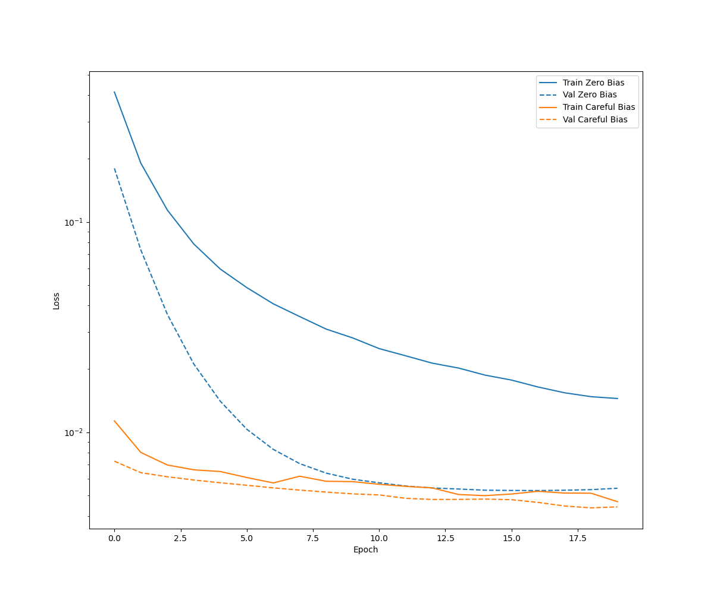
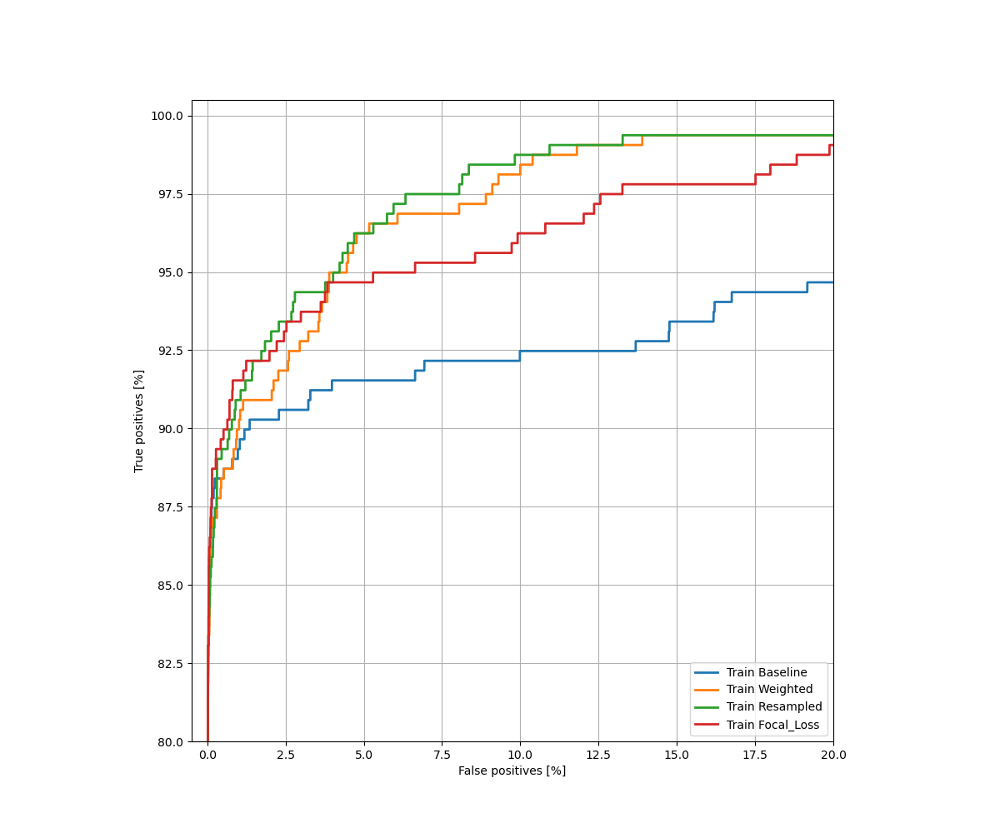
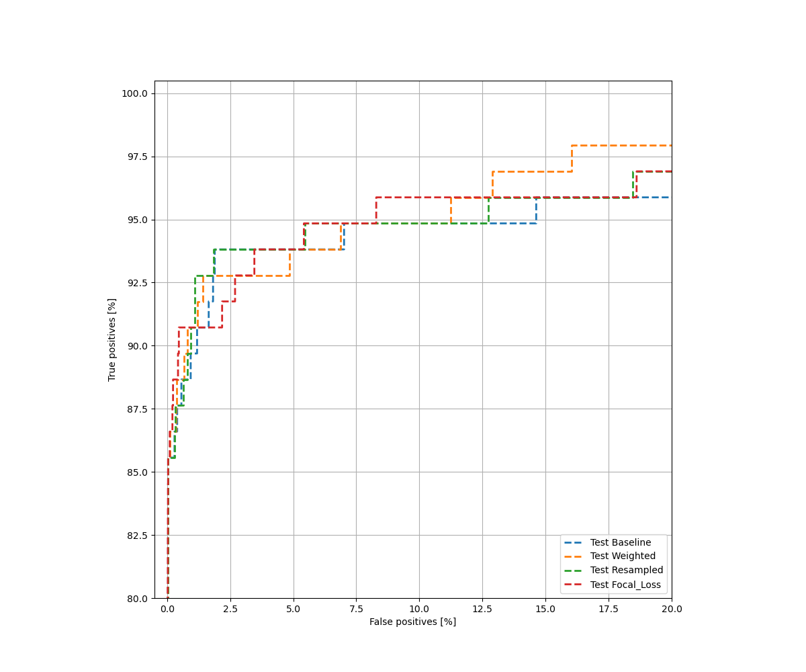
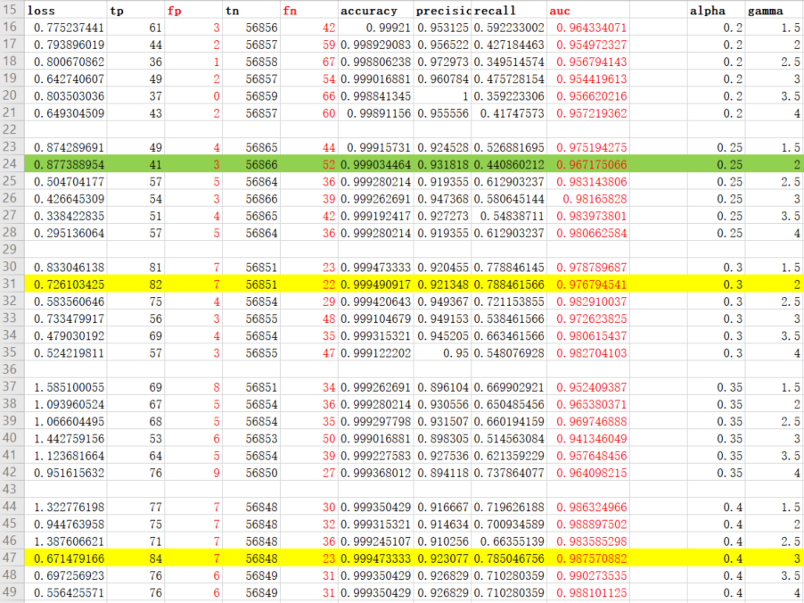

# Classification-on-imbalanced-data

------

这是在数据极度不均衡的场景下的一个二分类实现，使用了**weighted class**，**oversampling**，**focal loss** 等多种方式进行了实验，主要是进行了方法的验证和各种方法结果的对比；对比是主要参看了指标**混淆矩阵** 和 **auc**，最后本实验中还着重对focal loss进行了简单的调参：

------

### 1. 代码结构说明
> 1. load_data_and_model.py主要用于加载数据，对数据进行基本的预处理（数据的归一化，部分数据取log，丢弃无用数据等，可以看作是简单的特征工程）；然后定义了评价指标并定义了创建模型的方法，对训练的一些超参如epochs和batchsize也是在此文件定义。模型代码使用tf2的keras.Sequential创建了一个简单的模型，仅用来验证几种不同的处理不均衡的方法。模型代码和绘图代码参考于tensorflow2 tutorial的官网实现：https://tensorflow.google.cn/tutorials/structured_data/imbalanced_data，我增加了focal loss的实现，并一起进行对比。
> 2. draw_helper.py是一些绘图的辅助函数；
> 3. comparison.py里使用添加经验bias的方法、类别加权、上采样、使用focal loss的方法分别训练模型，并得出评价，以及对比结果；
> 4. tune_params_for_focal_loss.py主要是对focal loss的 $\alpha$ 和 $\gamma$ 进行调参，主要就是选定了一个范围，两重循环，类似于网格搜索

### 2. 实验环境说明

> * python3.6.9
> * tensorflow 2.4.x
> * gpu：NVIDIA V100 (32G)


### 3. 实验结果说明



上图可以看出，bias有助于改善模型训练，模型的初期几个epoch不用再学习bias的变化。

接下来就以加了先验bias的模型作为**baseline**，分别验证其他各种解决样本不均衡的方法





上图可以看出，各路方法都在baseline的基础上有所提升。

### 4. focal loss调参说明

调参使用的是tune_params_for_focal_loss.py，测试了一组$\alpha$ 和 $\gamma$，原论文的最佳组合是$\alpha=0.25$ 和 $\gamma=2.$，我在实验中的best params是$\alpha=0.3$ 和 $\gamma=2.$
```python
alphas = np.arange(0.1, 0.41, 0.05)#[0.1, 0.15, 0.2, 0.25, 0.3, 0.35, 0.4]
gammas = np.arange(1., 4.1, 0.5)#[1.0, 1.5, 2., 2.5, 3., 3.5, 4.]
```

可见$\alpha=0.3$ 和 $\gamma=2.$综合结果最好，因为我们更关注FN、FP以及AUC，例如这是一个信用卡欺诈的数据集，正例表示交易存在异常是一个欺诈行为，那么FN会导致这个交易通过，带来重大损失，而如果FP大，又会是的一个正常的交易被识别成一个欺诈交易，从而给客户发去验证和警告邮件，也会给客户带来不好的体验。对于这种数据极度不均衡的数据（正例只占0.17%）acc指标已经不可行，ROC曲线是不错的指标，外部ROC如果能包住内部ROC，则外部ROC对应的结果性能更高。
